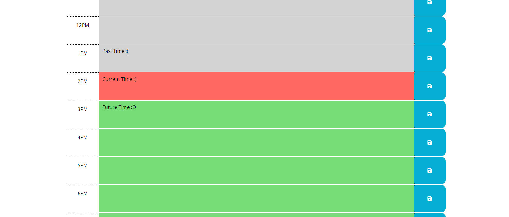
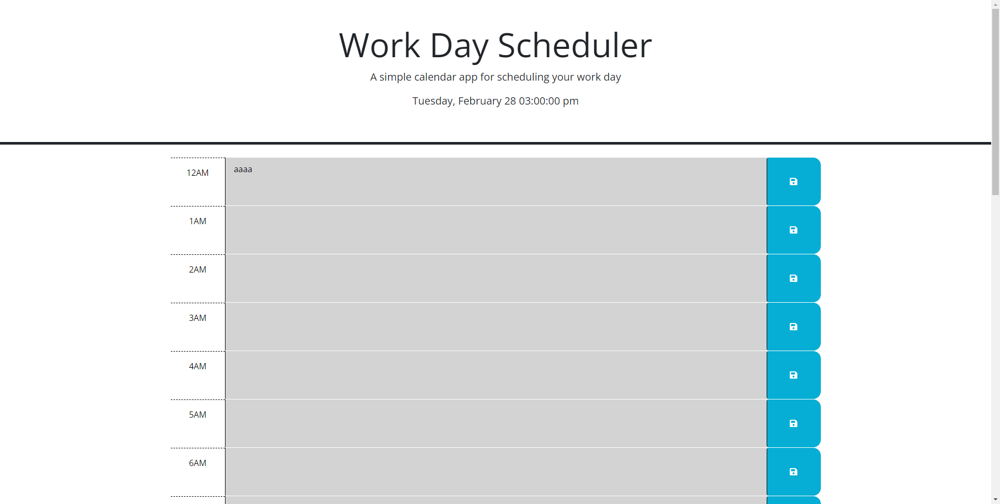
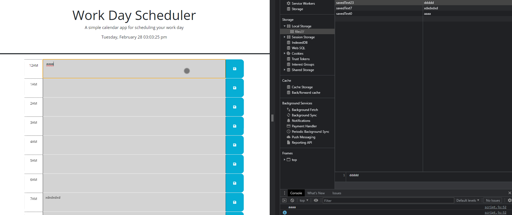

# 05 Third-Party APIs: Work Day Scheduler

## Description
  Our task was to create a simple calendar application that would allow a user to input any random event into a given timeslot, and when they hit save it would save that input in local storage, which would then be pulled up whenever the user would refresh or re-open the page.

## How it functions
  The functionality is very simple:
  1. Open up the Work Day Scheduler
  2. Find which time slot you needed, and input the event you want to track there.
  3. Close the application.
  4. Re-open the application at your convenience to check the saved input.

## Examples

